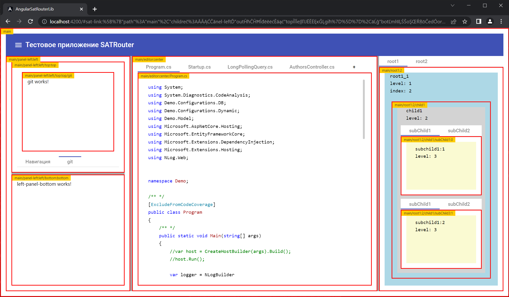

# SATRouter
Библиотека реализующая собственный механизм маршрутизации, вместо стандартного.
- [x] Имеет возможность любого уровня вложенности, эта функциональность отсутствует в стандартном Router
- [x] Работает на основе состояния, представленного в виде обычного массива объектов
- [x] Состояние может содержит в себе все необходимые для работы приложения
- [x] Состояние сериализует в адресную строку на основе указанных функций преобразования из/в строку.
- [x] Состояние можно получать из любого источника
- [x] Маршруты могут быть динамическими (добавляться/удалятся налету)
- [x] Поддерживает динамическую загрузку модулей
- [x] Множество дополнительных вариантов


[Исходный код](https://github.com/AlexanderZhelnin/Angular-SAT-Router)

* [SATRouterModule](#satroutermodule)
* [SAT_LINK_PARSE](#sat_link_parse)
* [SAT_STATE_STRINGIFY](#sat_state_stringify)
* [SATRouterOutletComponent](#satrouteroutletcomponent)
* [SATRouterService](#satrouterservice)
* [SATRouterLinkActive](#satrouterlinkactive)
* [Debug](#debug)

## SATRouterModule
Добавляет директивы и сервисы для навигации внутри приложения между представлениями, определенными в приложении. Вы можете импортировать этот NgModule несколько раз, по одному разу, для каждого модуля с отложенной загрузкой.
```ts

@NgModule({
  declarations: [
    //
  ],
  imports: [    
    SATRouterModule.create(
      // Загрузка определённого компонента
      { path: 'root1', component: RootComponent },
      // Динамически загружаемый модуль
      { path: 'root2', loadChildren: () => import('./modules/root2.module').then(_ => _.Root2Module) }
    )
  ],
```
Указанная регистрация на самом деле регистрирует модуль и провайдер с маршрутами.
Вы можете зарегистрировать и по отдельности, например для обеспечения динамических маршрутов
```ts
@NgModule({ 
  imports: [    
    SATRouterModule
  ],
  providers: [
    {
      provide: SAT_ROUTE_LOADERS, useFactory: (s_files: MainService) =>
      {
        return s_files.files$
          .pipe(
            first(),
            map(fs => [
              { path: '', component: EditorsComponent },
              ...fs.map(f => ({ path: f, component: EditorComponent, alwaysNew: true }))
            ]));

      }, deps: [MainService]
    }
  ]
})
```

## SAT_LINK_PARSE
Токен представляющий функцию преобразования из строки в полное состояние маршрута
```ts
providers: [
  {
    provide: SAT_LINK_PARSE,
    useValue: (link: string) =>
    {
      link = /sat-link:([a-z0-9==%"]+)/img.exec(link)?.[1] ?? '';

      if (!link) return of<SATStateNode[]>(
        [0, 1, 2].map(index => ({
          path: 'root1',
          outlet: index.toString(),
          params: { index },
          children: [
            {
              path: 'child1',
              children: [
                { path: 'subChild1', outlet: '0' },
                { path: 'subChild3', outlet: '1' }
              ]
            }
          ]
        }))
      );

      const s = unzip(decodeURIComponent(link));
      return of(JSON.parse(s));
    }
  },
```
## SAT_STATE_STRINGIFY
Токен представляющий функцию преобразования из полного состояния маршрута в строку
```ts
providers: [
 {
   provide: SAT_STATE_STRINGIFY,
   useValue: (rs: SATStateNode[]) =>
   {
     const s = encodeURIComponent(zip(JSON.stringify(rs)));
     return of(`#sat-link:${s}`);
   }
 }
```

## SATRouterService
Сервис для навигации
### Перейти по строковой ссылке
```ts
navigate('root1/1');
```
### Перейти по состоянию маршрута
```ts
navigate([
{
  path: 'root1',
  params: { name: '123' },
  children: [
    {
      path: '1', params: { id: '321' },
      children: [
        { name: 'left', params: { userId: '321' } },
        { name: 'right', params: { userId: '3212' } },
      ]
    }
  ]
},
{
  path: 'root1',
  name: 'rootRight',
  params: ['', 2,],
  children: [
    { name: 'left', params: { admin: true } },
    { name: 'right', params: ['right2', 6] },
  ]
}
])
```

## SATRouterOutletComponent
Контейнер маршрута, который динамически заполняется в зависимости от текущего состояния маршрутизатора.

Каждый контейнер маршрута может иметь уникальное имя, определяемое необязательным атрибутом `name`.
```html
<sat-router-outlet></sat-router-outlet>
<sat-router-outlet name='left'></sat-router-outlet>
<sat-router-outlet name='right'></sat-router-outlet>
```
Именованные контейнеры маршрута будут целями маршрута с тем же именем.

Объект `SATStateNode` для именованного маршрута имеет свойство `outlet` для идентификации целевого контейнера маршрута:
`{path: <base-path>, component: <component>, outlet: <target_outlet_name>}`


## SATRouterLinkActive
Директива для обнаружения активности маршрута

```html
<nav mat-tab-nav-bar>
  <a mat-tab-link (click)="onClick1()" 
     [satRouterLinkActive]="{rout_path}"
     [routerOutlet]="outlet">
    {{tab1_header}}
  </a>

  <a mat-tab-link (click)="onClick2()" 
     [satRouterLinkActive]="{rout_path}"
     [routerOutlet]="outlet">
    {{tab2_header}}
  </a>
</nav>
<sat-router-outlet #outlet ></sat-router-outlet>
```

## Debug
Предусмотрен режим отладки с показом SATRouterOutletComponent и текущем состоянием маршрута
для этого необходимо зарегистрировать провайдер
```ts
{ provide: SAT_ROUTE_CONFIGURATION, useValue: { debug: true } }
```

