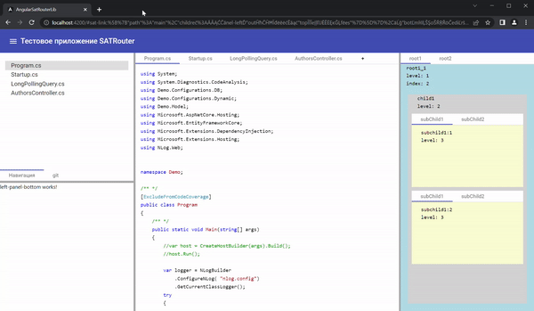
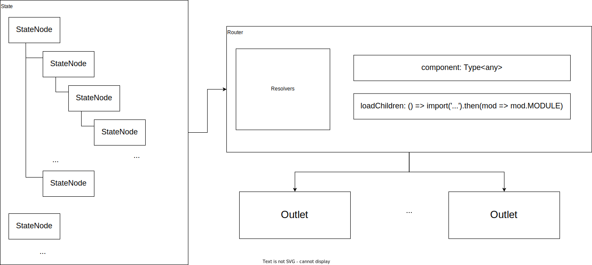
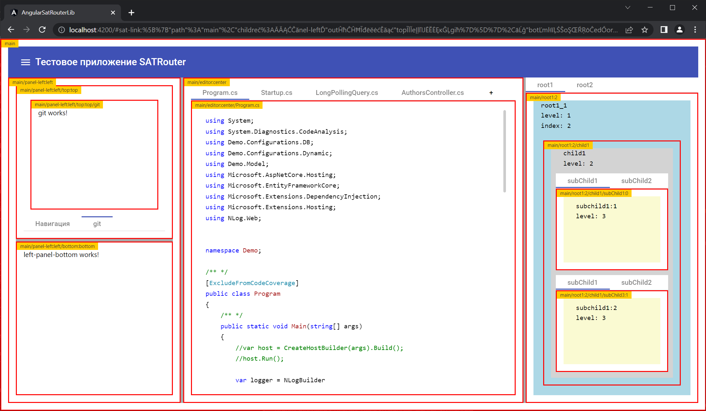

# SATRouter
Библиотека реализующая собственный механизм маршрутизации, вместо стандартного.
- [x] Имеет возможность любого уровня вложенности, эта функциональность отсутствует в стандартном Router
- [x] Работает на основе состояния, представленного в виде обычного массива объектов
- [x] Состояние может содержит в себе все необходимые для работы приложения
- [x] Состояние сериализует в адресную строку на основе указанных функций преобразования из/в строку.
- [x] Состояние можно получать из любого источника
- [x] Маршруты могут быть динамическими (добавляться/удалятся налету)
- [x] Поддерживает динамическую загрузку модулей
- [x] Множество дополнительных вариантов





[Исходный код](https://github.com/AlexanderZhelnin/Angular-SAT-Router)
[Песочница](https://stackblitz.com/edit/sat-routing)

[](https://youtu.be/ZyVZUns1lL8)

* [SATRouterModule](#satroutermodule)
* [SAT_LINK_PARSE](#sat_link_parse)
* [SAT_STATE_STRINGIFY](#sat_state_stringify)
* [SATRouterOutletComponent](#satrouteroutletcomponent)
* [SATRouterService](#satrouterservice)
* [SATRouterLinkActive](#satrouterlinkactive)
* [Защитники](#защитники)
* [Debug](#отладка)
* [Типы](#типы)

## SATRouterModule
Добавляет директивы и сервисы для навигации внутри приложения между представлениями, определенными в приложении. Вы можете импортировать этот NgModule несколько раз, по одному разу, для каждого модуля с отложенной загрузкой.

смотри раздел [ISATRouteResolver](#isatrouteresolver)

```ts
@NgModule({
  declarations: [
    //
  ],
  imports: [    
    SATRouterModule.create(
      // Загрузка определённого компонента
      { path: 'root1', component: RootComponent },
      // Динамически загружаемый модуль
      { 
        path: 'root2', 
        loadChildren: () => 
          import('./modules/root2.module').then(_ => _.Root2Module) 
      }
    )
  ],
```
Указанная регистрация на самом деле регистрирует модуль и провайдер с маршрутами.
Вы можете зарегистрировать и по отдельности, например для обеспечения динамических маршрутов
```ts
@NgModule({ 
  imports: [    
    SATRouterModule
  ],
  providers: [
    {
      provide: SAT_ROUTE_RESOLVERS, useFactory: (s_files: MainService) =>
      {
        return s_files.files$
          .pipe(
            first(),
            map(fs => [
              { path: '', component: EditorsComponent },
              ...fs.map(f => ({ 
                path: f, 
                component: EditorComponent, 
                alwaysNew: true
                /* так как компонент не меняется, 
                   что бы была анимация указываем флаг alwaysNew */ 
              }))
            ]));

      }, deps: [MainService]
    }
  ]
})
```

## SAT_LINK_PARSE
Токен представляющий функцию преобразования из строки в полное состояние маршрута
```ts
providers: [
  {
    provide: SAT_LINK_PARSE,
    useValue: (link: string) =>
    {
      link = /sat-link:([a-z0-9==%_\.\-"]+)/img.exec(link)?.[1] ?? '';

      if (!link) return of<ISATStateNode[]>(
        [0, 1, 2].map(index => ({
          path: 'root1',
          outlet: index.toString(),
          params: { index },
          children: [
            {
              path: 'child1',
              children: [
                { path: 'subChild1', outlet: '0' },
                { path: 'subChild3', outlet: '1' }
              ]
            }
          ]
        }))
      );

      const s = unzip(decodeURIComponent(link));
      return of(JSON.parse(s));
    }
  },
```
## SAT_STATE_STRINGIFY
Токен представляющий функцию преобразования из полного состояния маршрута в строку
```ts
providers: [
 {
   provide: SAT_STATE_STRINGIFY,
   useValue: (rs: ISATStateNode[]) =>
   {
     const s = encodeURIComponent(zip(JSON.stringify(rs)));
     return of(`#sat-link:${s}`);
   }
 }
```

## SATRouterService
Сервис для навигации
### Перейти по строковой ссылке
```ts
navigate('root1/1');
```
### Перейти по состоянию маршрута
```ts
navigate([
{
  path: 'root1',
  params: { name: '123' },
  children: [
    {
      path: '1', params: { id: '321' },
      children: [
        { name: 'left', params: { userId: '321' } },
        { name: 'right', params: { userId: '3212' } },
      ]
    }
  ]
},
{
  path: 'root1',
  name: 'rootRight',
  params: ['', 2,],
  children: [
    { name: 'left', params: { admin: true } },
    { name: 'right', params: ['right2', 6] },
  ]
}
])
```
### updateHistoryAsync
Обновление адресной строки браузера
### cloneState
Копия маршрута с выделением текущего уровня
Служит для модернизации полного маршрута с последующим переходом
```ts
const cloned = cloneState(address);
if (!cloned.currentNode) return;
cloned.currentNode.path = newPath;
this.s_router.navigate(cloned.state);
```
### getNode
Получить узел данных маршрута
## SATRouterOutletComponent
Контейнер маршрута, который динамически заполняется в зависимости от текущего состояния маршрутизатора.

Каждый контейнер маршрута может иметь уникальное имя, определяемое необязательным атрибутом `name`.
```html
<sat-router-outlet></sat-router-outlet>
<sat-router-outlet name='left'></sat-router-outlet>
<sat-router-outlet name='right'></sat-router-outlet>
```
Именованные контейнеры маршрута будут целями маршрута с тем же именем.

Объект [ISATStateNode](#isatstatenode) для именованного маршрута имеет свойство `outlet` для идентификации целевого контейнера маршрута:
```ts{path: <base-path>, component: <component>, outlet: <target_outlet_name>}```

## SATRouterLinkActive
Директива для обнаружения активности маршрута

### Свойства

#### Контейнер маршрута
```ts
routerOutlet: SATRouterOutletComponent | undefined
```
#### Событие активации отслеживаемого маршрута
```ts
isActive$: BehaviorSubject<boolean>
```
#### Событие активации отслеживаемого маршрута
```ts
activated: EventEmitter<string>
```
### Пример использования
```html
<nav mat-tab-nav-bar>
  <a mat-tab-link (click)="onTabClick()" 
     [satRouterLinkActive]="{rout_path}"
     [routerOutlet]="outlet"
     #rl="satRouterLinkActive"
     [active]="rl.isActive$ | async">
    {{tab1_header}}
  </a>

</nav>
<sat-router-outlet #outlet ></sat-router-outlet>
```
## Защитники
### canActivate
Проводит проверку можно ли перейти к маршруту

Представлен в виде свойства распознавателя маршрута [ISATRouteResolver](#isatrouteresolver) `canActivate` и интерфейсом [ISATCanActivate](#isatcanactivate)
может принимать одиночный объект SATCanActivate или массив SATCanActivate[]

### canDeactivate
Проводит проверку можно ли покинуть маршрут
Представлен в виде свойства распознавателя маршрута [ISATRouteResolver](#isatrouteresolver) `canDeactivate` и интерфейсом [ISATCanDeActivate](#isatcandeactivate)
может принимать одиночный объект SATCanDeActivate или массив SATCanDeActivate[]

## Отладка
Предусмотрен режим отладки с показом SATRouterOutletComponent и текущем состоянием маршрута
для этого необходимо зарегистрировать провайдер
```ts
{ provide: SAT_ROUTE_CONFIGURATION, useValue: { debug: true } }
```


## Типы 
### ISATStateNode
```ts
interface ISATStateNode
{
  /** Путь маршрута */
  path?: string;
  /** Имя контейнера маршрута */
  outlet?: string;
  /** Дочерние маршруты */
  children?: ISATStateNode[];
  /** Параметры маршрута*/
  params?: any;
}
ts
### ISATRouteResolver
Интерфейс распознавателя части маршрута
```ts
interface ISATRouteResolver
{
  /** Путь маршрута, если есть именованные контейнеры,
   * то они пишутся `{путь}:{outlet}`
   */
  path: string;
  /** Тип компонента */
  component?: Type<any>;
  /** Загрузчик динамического модуля */
  loadChildren?: LoadChildrenCallback;
  /** Перенаправление */
  redirectTo?: string;
  /** Можно ли активировать */
  canActivate?: ISATCanActivate | ISATCanActivate[];
  /** Можно ли деактивировать */
  canDeactivate?: ISATCanDeActivate | ISATCanDeActivate[];
  /** Можно ли выгружать */
  canUnload?: boolean;
  /** Не проверять на изменение компонента */
  alwaysNew?: boolean;
}
```
### ISATCanActivate
Интерфейс имеет одну функцию, функция может быть асинхронной 
```ts
interface ISATCanActivate
{
  canActivate(state: RoutePath): 
  Observable<boolean> | Promise<boolean> | boolean;
}
```
Пример:
```ts
SATRouterModule.create([
  { path: '', component: Child1Component },  
  { path: 'subChild3:1', component: Child1Sub1Component },
  {
    path: 'subChild4:1', component: Child1Sub2Component,
    canActivate:
    {
      // тут пример асинхронной проверки реализованной через Promise
      canActivate: async (state: RoutePath) =>
      {
        alert(`нельзя перейти в маршрут "subChild4:1"`)
        return false;
      }
    },
    // при неудачной проверке на активацию перейти на маршрут
    redirectTo: 'subChild3:1'
  }
])
```
### ISATCanDeActivate
интерфейс имеет одну функцию, функция может быть асинхронной 
```ts
interface ISATCanDeActivate
{
  canDeActivate(component: any, state: RoutePath): 
    Observable<boolean> | Promise<boolean> | boolean;
}
```
пример
```ts
SATRouterModule.create([
  { path: '', component: Child1Component },  
  {
    path: 'subChild2:0', component: Child1Sub2Component,
    canDeactivate: {
      // тут пример асинхронной проверки реализованной через Promise
      canDeActivate: async (component: any, state: RoutePath) =>
      {
        alert('нельзя покинуть маршрут "subChild2:0"')
        return false;
      }
    }
  }
])
```
